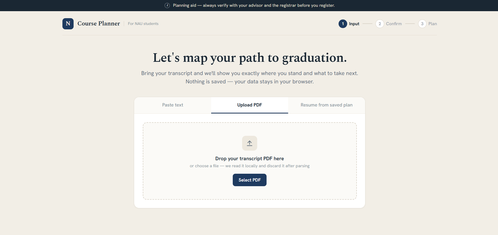
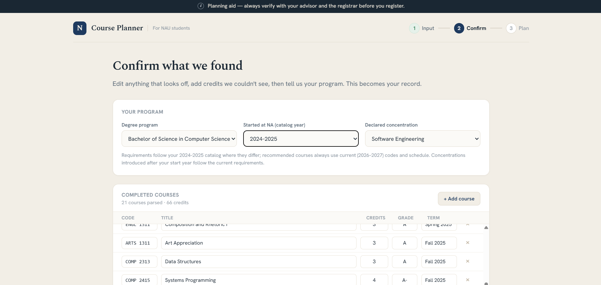
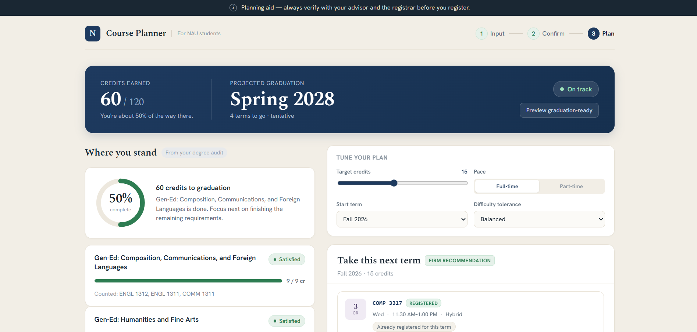
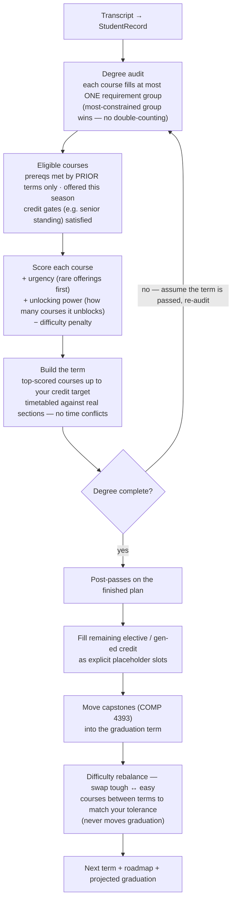

<div align="center">


# NA Course Planner

**Upload your transcript → get a degree audit, a conflict-free next term, and a roadmap to graduation.**

A stateless web tool for North American University (NA) students. Nothing is stored — your data stays in your browser.

[](https://github.com/Samat-ai/na-course-planner/actions/workflows/ci.yml)
[](https://course-planner.dev)
[](https://www.python.org/)
[](https://fastapi.tiangolo.com/)
[](https://docs.pydantic.dev/)
[](https://pytest.org/)
[](https://docs.astral.sh/ruff/)
[](https://vercel.com/)

**Live: [course-planner.dev](https://course-planner.dev)**

</div>

---

## What it does

- Parses transcript **text or PDF** into a structured student record
- **Audits** progress against NA program requirements (catalog-year aware, concentration grandfathering, exam/transfer credit)
- Recommends a **conflict-free next term** — real sections, no time clashes, prerequisite and load checks
- Builds a tentative **multi-term roadmap** with a projected graduation date
- Tunable: target credits, full/part-time pace, difficulty tolerance
- Exports plans as **JSON or PDF**

## Screenshots

**1 — Drop in your transcript** (parsed locally, discarded after parsing):



**2 — Confirm what was parsed**, pick your program, start year, and concentration:



**3 — Get your plan**: audit status, next-term recommendation with sections, and a roadmap to graduation:



## How the engine thinks

The planner simulates your degree term by term. Each simulated term re-runs the full audit, so every recommendation is grounded in what would *actually* be satisfied by then:



A few rules the engine never breaks:

| Rule | Meaning |
|---|---|
| **No double-counting** | A completed course satisfies at most one requirement group. |
| **Prior-terms prereqs** | A course planned this term never satisfies another same-term course's prerequisite. |
| **Offering evidence** | If the schedule shows a course only runs in spring, it's never planned into a fall term. |
| **`WIP` handling** | In-progress courses are assumed-complete for planning (they unlock prereqs) but not yet earned in the audit. |
| **Choice slots** | When options are genuinely equivalent, you pick — the engine only auto-picks on an objective signal. |
| **Preferences reallocate, never delay** | Difficulty tolerance re-shuffles which term a course lands in; your graduation date is decided only by credits and prerequisites. |

**Example** — why an operating-systems course beats an art elective for the same slot: it unlocks three later courses (+0.8 each), counts toward a rarely-offered chain (urgency ↑), and the difficulty penalty (−0.3 × 3) is small next to that. The art course scores low now precisely because it can be slotted *anywhere* later — and the difficulty rebalancer will do exactly that if your tolerance asks for a lighter term.

## Quick start

```bash
# install
py -3 -m pip install -r requirements.txt
py -3 -m pip install -e .[dev]

# test
py -3 -m pytest -q

# run the API + UI
py -3 -m uvicorn na_planner.api.app:app --reload
```

Open:
- UI: `http://127.0.0.1:8000/`
- API docs: `http://127.0.0.1:8000/docs`

> On Windows, use `py -3` (not `python`/`python3`).

## CLI usage

```bash
py -3 -m na_planner.cli audit data/programs/cs-bs-2026.yaml tests/fixtures/sample_student.json
py -3 -m na_planner.cli recommend data/programs/cs-bs-2026.yaml tests/fixtures/sample_student.json
```

## API surface

| Method | Path | Purpose |
|---|---|---|
| GET | `/health` | Liveness check |
| GET | `/programs` | List available programs |
| GET | `/programs/{code}/courses` | Program course list |
| GET | `/programs/{code}/concentrations` | Declarable concentrations |
| GET | `/programs/{code}/concentration-years` | Available concentration overlays |
| GET | `/exam-chart` | Exam-credit chart for catalog year |
| POST | `/resolve-exams` | Resolve exam credit diagnostics |
| POST | `/parse/text` | Parse transcript text |
| POST | `/parse/pdf` | Parse transcript PDF |
| POST | `/audit` | Degree audit |
| POST | `/recommend` | Next-term + roadmap recommendation |
| POST | `/export/json` | Export recommendation as JSON |
| POST | `/export/pdf` | Export recommendation as PDF |

## Repository layout

```
src/na_planner/          # domain engine, ingestion, API, static UI
data/programs/           # versioned program requirements (YAML, by catalog year)
data/concentrations/     # concentration overlays by year
data/schedules/          # course schedule snapshots
docs/                    # architecture, design records, references, screenshots
tests/                   # full test suite
```

The domain core (`models/`, `audit`, `prereqs`, `eligibility`, `scoring`, `planner`, `roadmap`) is pure — no I/O — and fully unit-tested. Only the loaders, ingestion, and API layers touch files or the network.

## Contributing

See `CONTRIBUTING.md` for the workflow, TDD loop, and CI expectations. Architecture overview: `docs/ARCHITECTURE.md`.
